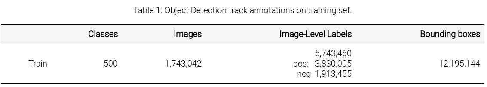

# Open Images Challenge 2018

## Intro

The Open Images Challenge 2018 is a new object detection challenge to be held at the European Conference on Computer Vision 2018. The challenge follows in the tradition of PASCAL VOC, ImageNet and COCO, but at an unprecedented scale. [Explore the dataset here.](https://storage.googleapis.com/openimages/web/challenge_visualizer/index.html)

The Challenge is based on Open Images V4. The Object Detection track covers 500 classes out of the 600 annotated with bounding boxes in Open Images V4. The evaluation metric is mean Average Precision (mAP) over the 500 classes. The images are annotated with positive image-level labels, indicating certain object classes are present, and with negative image-level labels, indicating certain classes are absent. All other unannotated classes are excluded from evaluation in that image. Thus participants are not penalized for producing false-positives on unannotated classes.

The classes are organized in a semantic hierarchy ([visualization](https://storage.googleapis.com/openimages/challenge_2018/bbox_labels_500_hierarchy_visualizer/circle.html)). The evaluation metric properly takes this into account, by integrating object instances upwards along the hierarchy. Detailed object detection metric protocol is explained [here](https://storage.googleapis.com/openimages/web/object_detection_metric.html).

#### Train data info :

#### Test data info
The test set consists of 100k images.

### How data is collected

### Evaluation Metric

* **Handling non-exhaustive image-level labeling** : The images are annotated with positive image-level labels, indicating certain object classes are present, and with negative image-level labels, indicating certain classes are absent. All other classes are unannotated. For each positive image-level label in an image, every instance of that object class in that image is annotated with a ground-truth box. For fair evaluation, all unannotated classes are excluded from evaluation in that image. If a detection has a class label unannotated on that image, it is ignored. All detections with negative image labels are counted as false positives

* **Labels hierarchy handling** : AP (Average Precision) score is evaluated for each of the 500 classes of the Challenge. For a leaf class in the hierarchy, AP is computed as normally in PASCAL VOC 2010 (e.g. 'Football Helmet'). However, in order to be consistent with the meaning of a non-leaf class, its AP is computed involving all its ground-truth object instances and all instances of its subclasses. The ground-truth files contain only leaf-most image-level labels and boxes. To produce ground-truth suitable for evaluating this metric correctly, please run the [script](https://github.com/tensorflow/models/blob/master/research/object_detection/dataset_tools/oid_hierarchical_labels_expansion.py) from Tensorflow Object Detection API repository on both image-level labels csv file and boxes csv file.

* **Handling group-of boxes** :  A group-of box is a single box containing several object instances in a group (i.e. more than 5 instances which are occluding each other and are physically touching). The exact location of a single object inside the group is unknown.

The final mAP is computed as the average AP over the 500 classes of the challenge. The participants will be ranked on this final metric.

## References:

1. [Kaggle Challenge link](https://www.kaggle.com/c/google-ai-open-images-object-detection-track)
2. [Open Images Challenge 2018 link](https://storage.googleapis.com/openimages/web/challenge.html)
3.
